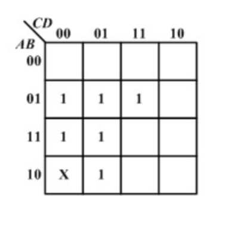
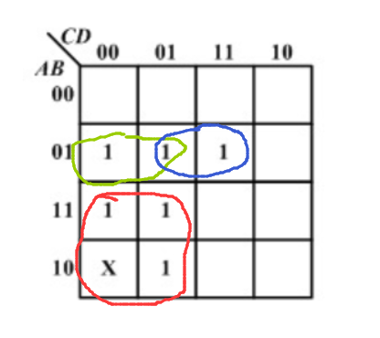
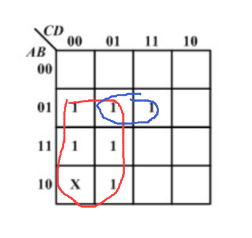
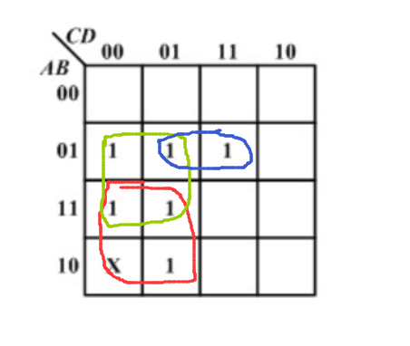

# 数字电路

## 第一章

### 编码方式

- 格雷码：抗干扰能力最强

### 进制转换

- 二进制：

  $2\to10$
  $$
  (1101.01)_2 = 1\times2^3+1\times2^2+0\times2^1+1\times2^0+0\times2^{-1}+1\times2^{-2}
  $$
  $10\to2$
  $$
  (157.75)_{10} = 2^7+2^4+2^3+2^2+2^0+2^{-1}+2^{-2} = (10011101.11)_2
  $$

  没有写出来的次方项是零（比如$6，5$）

- 十六进制：

  $16\to10$
  $$
  (2A.7F)_{16} = 2\times16^1+A\times16^0+7\times16^{-1}+F\times16^{-2}
  $$
  $10\to16$
  
  方法同二进制的，先找最大的$x\times16^y$，然后依次。
  
### 逻辑运算

#### 基本逻辑运算

$1\to$ 真，$0\to$ 假

- 与：$Y = A\cdot B$

- 或：$Y = A+B$ 

  大于$1$都算$1$

- 非：$Y = \overline {A}$​

  $A=0\to Y=\overline A = 1$

- 与非：$Y=\overline{A\cdot B} = A\odot B$

- 或非：$Y=\overline{A+B}$

- 与或非：$Y = \overline{A\cdot B + C\cdot D}$

- ==异或== ：$Y = \overline A \cdot B + A \cdot \overline B = A \oplus B$​

  **相同为假（$0$），相异为真（$1$​）**

#### 公式

大部分都和普通代数一样，列举一些不同的：
$$
(A+B)(A+C) = A+B\cdot C
$$
$$
\left \{
\begin{align*}
\overline{A\cdot B} = \overline A + \overline B\\
\overline{A+B} = \overline A \cdot \overline B
\end{align*}
\right .\qquad \text{分开取反加变乘}
$$

#### 三个规则

- 代入规则
  $$
  \overline{A\cdot B} = \overline A +\overline B
  $$
  用$Y= A \cdot C$代换$A$，依然成立。
  $$
  \overline{A\cdot C \cdot B} = \overline {A\cdot C} +\overline B = \overline A+\overline C+\overline B
  $$

- 反演规则

  表达式里“$+$”，“$\cdot$”；“$0$”，“$1$”；$A$，$\overline A$互换，那么就得到了$\overline Y$

  ==注意==：应遵从原来的运算顺序，例：
  $$
  Y = \overline A\cdot \overline B + C \cdot D\\
  \overline Y = (A+B)\cdot (\overline C + \overline D) \neq A+B\cdot \overline C + \overline D
  $$

- 对偶规则

  表达式里“$+$”，“$\cdot$”；“$0$”，“$1$​​”互换，表达式相等。==注意==：应遵从原来的运算顺序。

#### 最大项和最小项

- 最小项$m$
  $$
  m_5 = A\overline B C
  $$
  先把$5$化成二进制$101$，对应$ABC$，==$0$==的话就是==反==，然后==乘==起来。

- 最大项$M$
  $$
  M_5 = \overline A + B + \overline C
  $$
  ==$1$==的话就是==反==，然后==加==起来。

### 卡诺图
#### 卡诺图化简

用例题来说明

$X$是限制项，可以看做$0$或$1$

画图时遵循的原则：

- 画最少的圈

- 每个圈包含最多的数

- 必须有只属于自己的点

- 每个圈包含$2^n$​​个点

违反第二条:

> 每个圈包含最多的数

  违反第四条：

> 每个圈包含$2^n$个点

正确画法：

每个圈是一项，发生变化的去掉，如果是$0$就取反。

以红色圈子举例：$B,D$变了，所以只有$A,C$，$C$是$0$，所以取反。$\Rightarrow A\overline C$

所以答案是
$$
A\overline C + B\overline C + \overline A B D
$$

#### 式子画成卡诺图：

按照格雷码排列

第一行第一列是$A,B,C,D = 0,0,0,0$的时候式子的真假（$0,1$​）

第一行第二列是$A,B,C,D = 0,0,0,1$的时候式子的真假（$0,1$​）

…………

…………

| AB\CD  | 00   | 01   | 11   | 10   |
| :----: | ---- | ---- | ---- | ---- |
| **00** |      |      |      |      |
| **01** |      |      |      |      |
| **11** |      |      |      |      |
| **10** |      |      |      |      |

